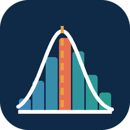

# Estadística Fundamental

**Aprende a interpretar datos, no solo a calcularlos.**

Aplicación móvil educativa para estudiantes universitarios de cualquier carrera.
Parte de un diagnóstico concreto: *los estudiantes saben las fórmulas y no saben
qué significan los números que obtienen*. Todo lo que hay en la app es
consecuencia de esa frase.

<p align="center">
  
</p>

---

## Qué la diferencia de un cuestionario con teoría

**1 · La calculadora está siempre a un toque.**
Si el problema real es interpretar, evaluar aritmética es evaluar lo que ya se
sabe hacer. El motor estadístico calcula todo al instante y el laboratorio de
datos está en la barra de navegación principal, no escondido dentro de una
lección. El esfuerzo del estudiante se gasta en decidir *qué medida usar* y
*qué significa*.

**2 · Cada ejercicio se responde dos veces: qué y por qué.**
La elección vale 0,6 y la justificación 0,4. En estadística descriptiva se puede
acertar por eliminación o por costumbre («ante la duda, la mediana») sin
entender nada. La app mide ese hueco y lo llama **acierto ciego**: el porcentaje
de veces que el estudiante eligió bien y no supo justificarlo. Aparece en la
pantalla de progreso como un indicador de primera clase.

**3 · Cada distractor declara qué confusión representa.**
Las alternativas incorrectas llevan etiquetas conceptuales
(`media_vs_mediana`, `eje_truncado`, `correlacion_causalidad`, `n_vs_n1`…). El
tutor lee ese historial y dice exactamente qué par de conceptos está mezclando
*este* estudiante, en lugar de «te falta estudiar dispersión».

**4 · Cinco laboratorios donde el estudiante fabrica el error.**
Mover un dato y ver que la media se desplaza y la mediana no. Truncar el eje de
un gráfico y ver una caída del 13 % convertirse en un derrumbe. Comparar dos
secciones con media, mediana y moda **idénticas** y dispersión opuesta. Se
aprende mejor produciendo la distorsión que leyendo sobre ella.

---

## Contenido

| Elemento | Cantidad |
|---|---|
| Módulos | 5 (Datos · Tablas · Medidas centrales · Dispersión · Gráficos) |
| Lecciones / tarjetas conceptuales | 20 / 93 |
| Laboratorios interactivos | 5, uno por módulo |
| Ejercicios | 50, de los cuales 15 piden justificación |
| Alternativas con retroalimentación propia | 181 |
| Conjuntos de datos con contexto | 16 (1 974 observaciones) |
| Confusiones conceptuales catalogadas | 28 |
| Términos del glosario | 46 |
| Temas del tutor | 33 |
| Archivos Dart / líneas | 69 / ~11 100 |
| Suites de prueba | 8 |

---

## Los cinco módulos

| # | Módulo | El error que corrige | Laboratorio |
|---|---|---|---|
| 1 | **Datos** | Calcular antes de preguntarse qué clase de dato se tiene | Clasificador de variables |
| 2 | **Tablas** | Rellenar la tabla de frecuencias como un trámite y no saber leerla | Constructor de tablas |
| 3 | **Medidas centrales** | Usar la media siempre, porque es la que se sabe calcular | Laboratorio del valor atípico |
| 4 | **Dispersión** | Calcular la desviación estándar sin poder decir qué significa | Dos secciones, la misma media |
| 5 | **Gráficos** | Elegir el gráfico por costumbre y leerlo sin mirar los ejes | Detector de gráficos engañosos |

---

## Arquitectura

```
presentation  →  domain  ←  data
```

El **dominio es Dart puro**: el motor estadístico, la corrección 60/40, las
reglas de avance y el tutor se prueban enteros sin arrancar Flutter.

**Dependencias de producción: dos.** `flutter_riverpod` y `shared_preferences`.

Sin backend, sin login, sin `build_runner`, sin librería de gráficos y sin
router declarativo. Los siete tipos de gráfico —histograma, barras, caja,
dispersión, puntos, líneas y circular— se dibujan con `CustomPainter` propio,
por tres razones: el histograma necesita marcar la media y la mediana en
colores fijos, el laboratorio del módulo 5 necesita mover el origen del eje en
vivo, y cada dependencia no añadida es una versión menos que puede romper el
build dentro de un año.

```
lib/
├── core/            tema, enrutado, utilidades de formato
├── domain/
│   ├── entities/    modelos inmutables
│   ├── services/    statistics · grading · progress · tutor  (Dart puro)
│   └── repositories/ interfaces
├── data/
│   ├── repositories/ assets, SharedPreferences, tutor local y adaptador remoto
├── presentation/
│   ├── providers/   Riverpod
│   ├── screens/     11 pantallas + 5 laboratorios
│   └── widgets/     7 gráficos propios + componentes comunes
└── main.dart
```

La app **funciona sin conexión**. El contenido va empaquetado en el APK: no hay
servidor que se caiga ni estudiante bloqueado por falta de datos.

---

## Decisión sobre IA

**El tutor del MVP es determinista, sobre un corpus curado de 33 temas.**

No es una limitación técnica, es la conclusión del análisis. La personalización
que importa aquí no es de redacción sino de contenido —*qué* confusión concreta
tiene este estudiante—, y eso lo produce el historial de etiquetas de error, no
un modelo generativo. A cambio, un modelo generativo introduce tres riesgos que
en estadística son caros: inventar una fórmula, afirmar causalidad a partir de
una correlación, y dar un número distinto al del motor de cálculo de la propia
app.

El tutor **dice cuándo no sabe**. Un tutor que responde siempre es un tutor en
el que no se puede confiar nunca.

`RemoteTutorRepository` implementa la misma interfaz y está preparado: activarlo
es una línea en `app_providers.dart`, bajo cuatro condiciones documentadas en
`docs/06_Decision_de_IA.md`.

---

## Compilar

### Requisitos

- Flutter 3.19 o superior (canal `stable`), Dart 3.3+
- JDK 17 para Android

### Local

Las carpetas `android/` e `ios/` **no se versionan**: se regeneran, lo que evita
los fallos de Gradle y AGP que aparecen meses después con scaffolding congelado.

```bash
flutter create --platforms=android,ios \
  --project-name estadistica_fundamental \
  --org com.estadisticafundamental .

flutter pub get
dart run flutter_launcher_icons      # iconos desde assets/icon/
flutter analyze --no-fatal-infos
flutter test
flutter run                          # o: flutter build apk --release
```

### GitHub Actions

| Workflow | Cuándo | Qué hace |
|---|---|---|
| `ci.yml` | push y pull request | Análisis estático, suite completa y cobertura |
| `build_apk.yml` | push a `main` y etiquetas `v*` | APK por ABI y universal, artefacto y release |

Para publicar una versión:

```bash
git tag v1.0.0 && git push origin v1.0.0
```

> El APK de release se firma con la clave de depuración que genera
> `flutter create`. Es **instalable para pruebas de campo y no publicable en
> Google Play**. Los pasos de firma real están en
> `docs/05_Despliegue_y_CI_CD.md`.

---

## Pruebas

```bash
flutter test
```

Ocho suites. Dos merecen mención aparte:

- **`content_integrity_test.dart`** — el contenido educativo vive en JSON para
  que lo edite quien no programa. El precio es que un id mal escrito o un
  ejercicio con dos alternativas correctas no lo detecta el compilador. Esta
  suite valida ids únicos, referencias cruzadas, etiquetas conceptuales
  existentes, una única respuesta correcta por pregunta, retroalimentación en
  cada alternativa y que cada confusión catalogada la produzca algún distractor.
- **`statistics_service_test.dart`** — además de probar el motor, **verifica las
  cifras que aparecen en los enunciados**: que `ds_traslado` sigue teniendo
  media 50,75 y mediana 40, que las secciones A y B siguen compartiendo las tres
  medidas de centro, y que las horas de sueño siguen cumpliendo la regla
  empírica al 68,4 %. Si alguien edita un dato del JSON y deja inconsistente un
  ejercicio, la suite falla.

---

## Cómo calcula

La app **declara su método** en la pantalla «Acerca de», porque el estudiante va
a contrastar los resultados con Excel o con su libro de curso y una discrepancia
sin explicación destruye la confianza en la herramienta.

- **Cuantiles**: interpolación lineal sobre la posición `(n − 1)·p` — el método
  de `PERCENTIL.INC` de Excel y Google Sheets (tipo 7 de Hyndman–Fan). Si tu
  texto usa `(n + 1)·p`, obtendrás valores algo distintos en Q₁ y Q₃: son
  convenciones diferentes, y lo correcto es declarar cuál se usa.
- **Varianza y desviación**: versión muestral, dividiendo entre `n − 1`.
- **Atípicos**: vallas de Tukey, `Q₁ − 1,5·RIC` y `Q₃ + 1,5·RIC`.
- **Clases**: regla de Sturges, `k = 1 + 3,322·log₁₀(n)`, como sugerencia.
- **Intervalos**: `[Lᵢ, Lₛ)`, cerrados por la izquierda, con el último cerrado.
- **Asimetría**: de la relación media–mediana, que es la comparación que el
  estudiante puede hacer a ojo y justificar en un examen.

---

## Sobre los datos

Los 16 conjuntos son **realistas y construidos para el curso**: reproducen
situaciones y órdenes de magnitud verosímiles del ámbito universitario peruano,
pero no proceden de un registro institucional real. Cada uno declara población,
unidad de análisis y procedencia, porque interpretar sin contexto es imposible.
La app lo dice explícitamente en «Acerca de».

---

## Documentación

| Documento | Contenido |
|---|---|
| `docs/01_Documento_de_Producto.md` | Problema, usuario, competencias, alcance del MVP |
| `docs/02_Especificacion_Funcional.md` | Pantallas, flujos y reglas de puntuación |
| `docs/03_Arquitectura_Tecnica.md` | Capas, modelo de datos y decisiones técnicas |
| `docs/04_Contenido_Educativo.md` | Módulos, laboratorios y catálogo de confusiones |
| `docs/05_Despliegue_y_CI_CD.md` | Compilación, firma real y publicación |
| `docs/06_Decision_de_IA.md` | Por qué el tutor no usa un LLM, y qué haría falta |

---

## Estado

Versión 1.0.0 (MVP). El proyecto se construyó **sin SDK de Flutter disponible en
el entorno de desarrollo**, así que no se ha compilado ni ejecutado en un
dispositivo: la primera puerta a superar es el workflow de CI. Todo lo que puede
verificarse sin compilar —integridad del contenido, cifras de los enunciados,
lógica de corrección, reglas de avance y comportamiento del tutor— está cubierto
por la suite de pruebas.

---

*Educational Mobile Apps Factory · Estadística universitaria · Todas las carreras*
